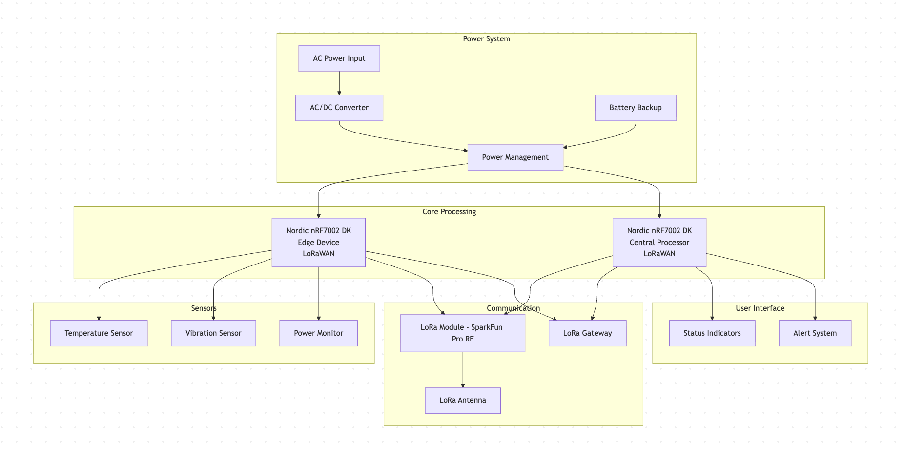
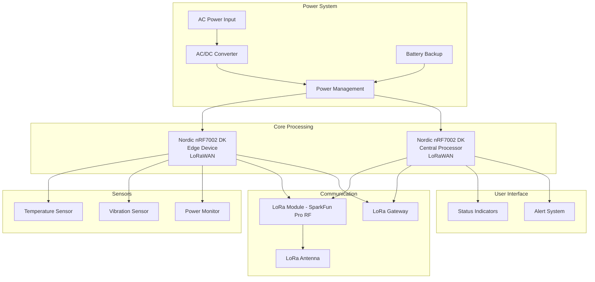
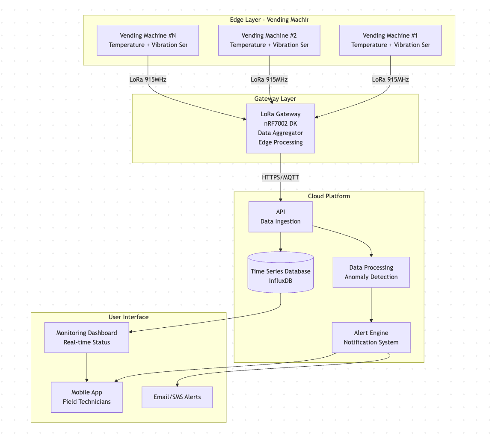
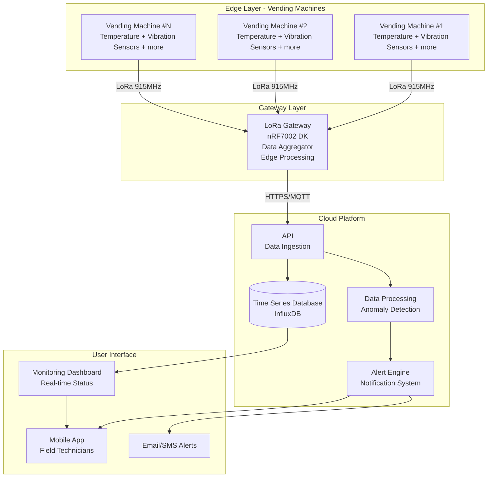

# IoT Venture Pitch
## ESE5180: IoT Wireless, Security, & Scaling

**Team Name:** The Circuiteers

| Team Member Name | Email Address         |
|------------------|-----------------------|
| Kevin Wang       | wazhi@seas.upenn.edu  |
| Shun Yao         |shunyao@seas.upenn.edu |
| Zheyu Li         |lizheyu@seas.upenn.edu |
| Megha Mistry     | megham@seas.upenn.edu |

**GitHub Repository URL:** https://github.com/ese5180/iot-venture-f25-the-circuiteers.git

## Concept Development

The vending machine industry represents a $22-25 billion global market [2] with a critical need for smart health monitoring systems, as traditional maintenance approaches are bleeding operators dry with hidden costs that eliminate profits for 73% of independent vending operators [1]. Current maintenance expenses range from $100-500 annually per machine, with monthly checks costing $50-100 and service incidents adding $50-200 each time, creating a maintenance burden that can constitute up to 15% of total operational costs [1]. By using sensors to monitor component health in real-time—such as power draw, temperature, and dispensing motor function—operators can preempt failures before they happen, a practice that can reduce maintenance costs by up to 25% over time. [3] Take a mid-sized vending operator with a fleet of 100 machines, the total annual maintenance contract cost would be $60,000 ($600/machine x 100 machines). A 25% reduction means an annual saving of $15,000. A health monitoring system prevents costly emergency repairs, optimizes service routes to eliminate unnecessary trips, and cuts product waste from overstocking or machine malfunctions. By transforming vending machines from static boxes into efficient, reliable, and more profitable assets, a smart health monitoring system provides a clear and rapid return on investment.

Sources:
1. https://dfyvending.com/vending-machine-maintenance-costs
2. https://www.nextmsc.com/report/vending-machine-market
3. https://businessplan-templates.com/blogs/startup-costs/vending-machine
4. https://www.news.market.us/vending-machine-statistics/ 

### Product Function

The product is a smart health monitoring system for vending machines that uses sensors to track critical components like temperature and motor vibration in real-time. It wirelessly transmits health data from distributed vending machines to a central processing system, enabling operators to monitor hundreds of machines simultaneously. The system provides predictive maintenance capabilities by identifying potential failures before they occur, helping vending operators reduce maintenance costs by up to 25% and prevent costly emergency repairs.

### Target Market & Demographics

- Primary Users: Vending machine operators, fleet managers, and maintenance technicians who need real-time visibility into machine health across distributed locations.

- Primary Customers: Commercial vending companies, facilities management companies, and large-scale vending operators managing 50+ machines.

- Geographic Deployment: Initially targeting the United States market, with expansion planned for urban areas in Canada and Europe where vending machine density is highest.

- Market Size: The global vending machine market size in 2024 was USD 23065.3 million, and is estimated to reach USD 25879.3 million in 2025 and is projected to reach USD 34959.4 million by 2030 with a CAGR of 6.20%. According to NMSC, in term of volume the market size was 12 million units in 2024, and is estimated to reach 15 million units in 2025 and is projected to reach 23 million units by 2030 with a CAGR of 9.3%. Source: https://www.nextmsc.com/report/vending-machine-market.

- Competitors: While asset monitoring systems (Augury) and smart (with capabilities to track sales, suggest products to purchase, do inventory monitring etc.) vending machines  exist (BetterHealth Vending, SMRT1 Technologies, Velocity Smart), there appears to be a gap in the area of health monitoring systems specifically for vending machines.

### Stakeholders

**Jeff Dreyer** serves as our key stakeholder and industry advisor for this vending machine health monitoring project. As Senior Director of Product Management and Enablement at Augmentir, Jeff brings over 10 years of experience in industrial IoT solutions and product development. His background spans from software engineering at ThingWorx (PTC) to his current role leading product enablement at Augmentir, where he focuses on connected worker solutions and industrial asset management. Jeff's expertise in IoT platforms, product strategy, and industrial automation makes him an invaluable advisor for developing our smart health monitoring system for vending machines. His insights will help ensure our solution aligns with industry best practices and market needs.

### System-Level Diagrams

#### Device Block Diagram

Source Code:

#### Communication Architecture Diagram

Source Code:

### Security Requirements Specification

The vending machine health monitoring system requires robust security measures to protect operational data, prevent unauthorized access to machine controls, and ensure the integrity of maintenance predictions. Security is critical as compromised systems could lead to false maintenance alerts, data theft, or disruption of vending operations.

**SEC 01** – All LoRaWAN communications shall use standard LoRaWAN 1.0.x security with unique device keys to prevent unauthorized devices from joining the network.

**SEC 02** – The cloud API shall require authentication tokens for all data submissions to prevent unauthorized data injection.

**SEC 03** – Firmware updates shall include checksums to verify integrity and prevent corrupted updates from bricking devices.

### Hardware Requirements Specification

The hardware platform consists of distributed sensor nodes deployed in vending machines, communicating via LoRa to a central gateway. The system must operate reliably in commercial environments with varying temperatures and electrical noise while maintaining low power consumption for battery-backed operation.

**HRS 01** – The system shall use Nordic nRF7002 DK as the primary microcontroller platform for both edge devices and central gateway, operating at 3.3V with integrated Wi-Fi/Bluetooth capabilities.

**HRS 02** – Temperature monitoring shall use I2C-based digital temperature sensors with ±5°C accuracy across -10°C to +110°C range, sampling at 1Hz minimum.

**HRS 03** – Vibration detection shall utilize a 3-axis MEMS accelerometer with 16-bit resolution to monitor motor health, sampling at 100Hz minimum.

**HRS 04** – The SparkFun Pro RF LoRa module shall provide 915MHz communication with minimum -148dBm sensitivity and +20dBm transmit power for reliable in-building coverage.

### Software Requirements Specification

The software system manages distributed sensor data collection, wireless transmission, edge processing, and predictive maintenance algorithms. Built on Zephyr RTOS, it ensures real-time performance while maintaining power efficiency for battery-operated edge nodes.

**SRS 01** – The edge device firmware shall collect temperature, vibration, and power consumption data every 60 seconds (±5 seconds) and transmit via LoRaWAN to the central gateway.

**SRS 02** – The system shall implement edge anomaly detection using a sliding window algorithm to identify temperature deviations or vibration patterns.

**SRS 03** – The gateway shall aggregate data from the vending machine and forward processed metrics to the cloud platform via MQTT/HTTPS every 5 minutes.

**SRS 04** – The software shall maintain a local data buffer capable of storing 24 hours of sensor readings in case of communication failure, with automatic retransmission upon connection restoration.