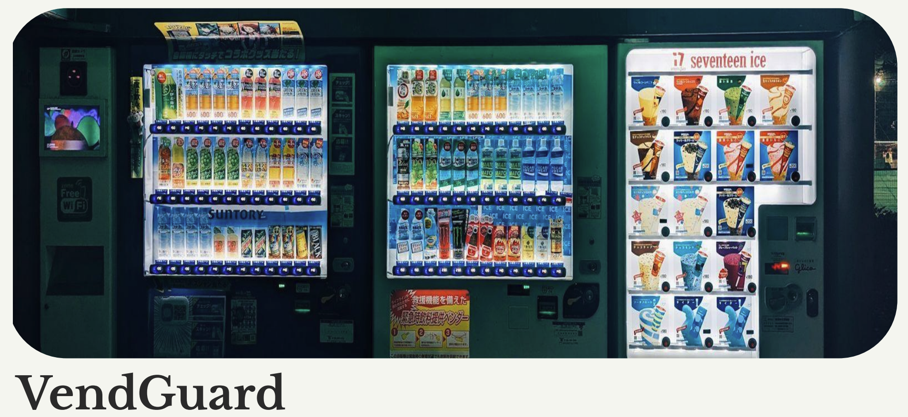
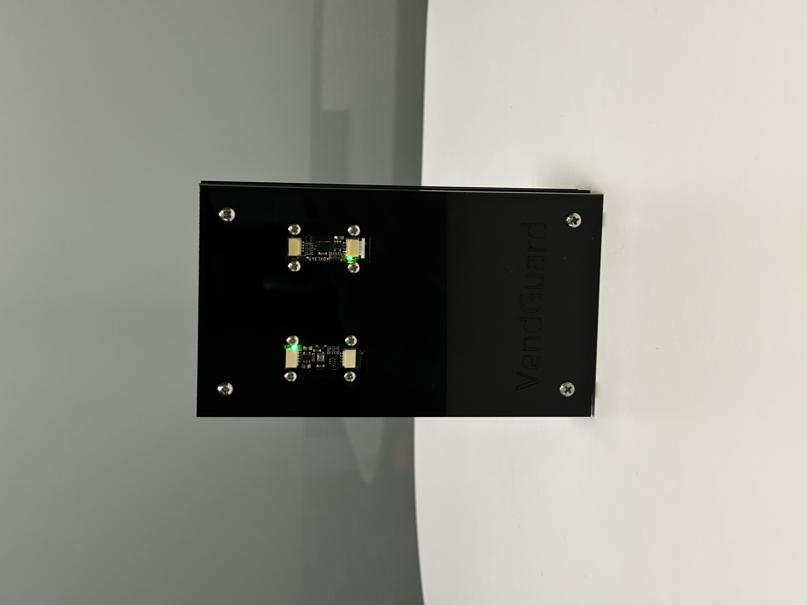
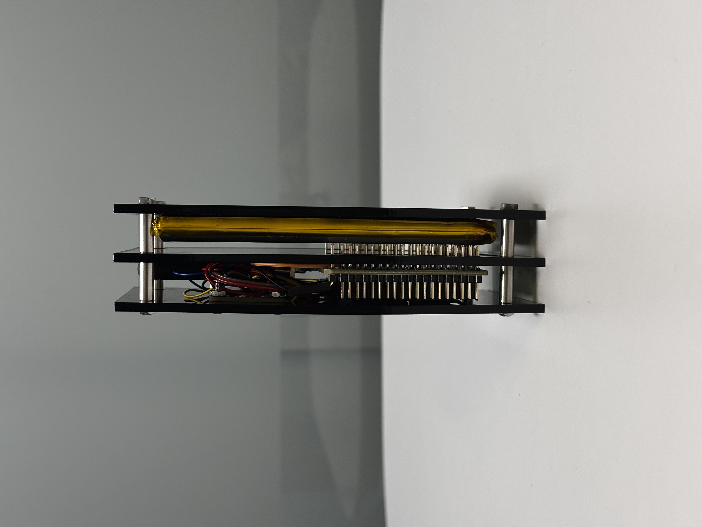
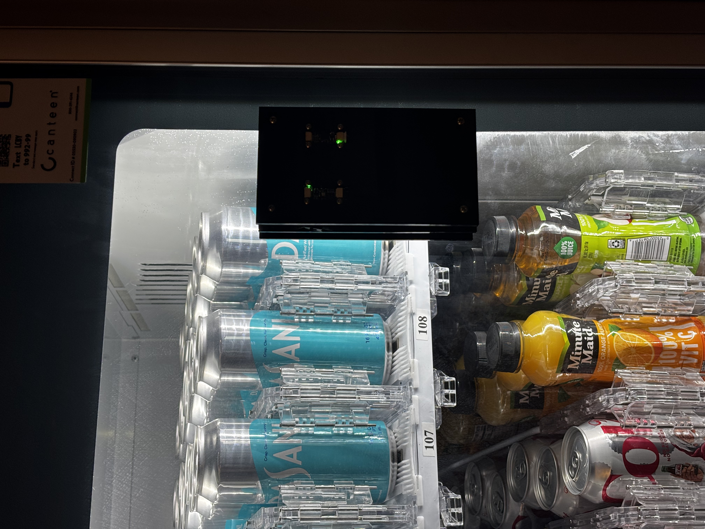
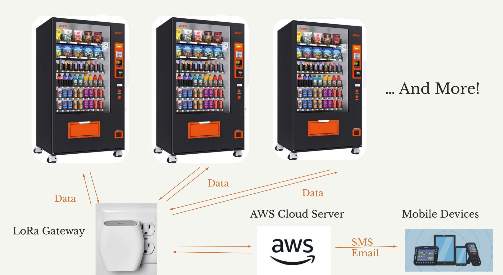

# VendGuard Report Website

**Team:** The Circuiteers  
**Members:** Kevin Wang, Shun Yao, Zheyu Li, Megha Mistry  
**Course:** ESE5180: IoT Wireless, Security, & Scaling (Fall 2025)

---

## Project Overview

**VendGuard** is a plug-and-play IoT solution designed to transform vending machine maintenance from reactive to predictive. By using sensors to monitor critical components—such as power draw, temperature, and dispensing motor function—VendGuard helps operators identify potential failures before they occur.

The vending machine industry represents a significant global market where maintenance costs can severely impact profitability. Traditional maintenance is often reactive and expensive. VendGuard aims to reduce these costs by up to 25% through real-time health monitoring and predictive analytics.

### Key Features

* **Edge Device:** Battery-backed sensor node (STM32WL55JC) monitoring temperature, humidity, pressure and vibration.
* **LoRaWAN Connectivity:** Long-range, low-power communication for distributed fleets.
* **Cloud Platform:** Centralized dashboard for real-time status and alerts using AWS IoT.
* **Secure:** End-to-end security with signed firmware updates (FUOTA) and secure boot.

---

## Final Report

### 1. Successes

We successfully implemented a complete end-to-end IoT data pipeline and secure over-the-air firmware update mechanism. Three key achievements stand out:

#### Complete Data Flow Architecture

We established a robust data acquisition and transmission pipeline spanning from edge sensor nodes to cloud infrastructure. The system seamlessly integrates:

* Sensor data collection at the MCU level
* LoRaWAN transmission through gateway infrastructure
* AWS cloud processing and analytics
* Real-time alert delivery to mobile endpoints

This demonstrates successful system integration across heterogeneous platforms and validates the feasibility of distributed IoT monitoring.

#### Secure Firmware Update Over The Air (FUOTA)

We implemented a production-grade FUOTA mechanism leveraging LoRaWAN as the transport layer with MCUboot as the secure bootloader. Despite the inherent bandwidth constraints of LoRaWAN and packet loss during transmission, the system reliably:

* Delivers and verifies new firmware images
* Uses ECDSA P-256 signatures for cryptographic verification
* Enables secure device updates without physical access

This capability is critical for large-scale IoT deployments where physical device access is impractical.

#### Robust Hardware Enclosure Design

The device enclosure was engineered to provide secure sensor mounting while maintaining optimal sensor exposure within the vending machine environment. Key features include:

* Secure mechanical mounting for all components
* Optimal sensor exposure for accurate environmental readings
* Mechanical reliability during transit and operation
* Preserved measurement accuracy for temperature and vibration sensors

#### Validated Real-World Anomaly Detection

We successfully deployed the prototype on an actual vending machine and demonstrated end-to-end functional validation. The system reliably:

* Detects abnormal vibration signatures from mechanical components
* Monitors temperature and humidity variations in the machine environment
* Captures anomalies in real-time with accurate sensor readings
* Delivers timely alerts to user mobile devices through the complete IoT pipeline

This real-world validation confirms the system's practical viability and the correctness of our end-to-end architecture in an operational environment.

---

### 2. Challenges & Failures

Several technical and design challenges emerged during the development cycle that warrant further investigation and optimization:

#### Power Budget Constraints

The current device's power consumption profile has not been fully validated in extended field deployments. Initial calculations suggest a battery lifetime of 5-6 months under typical usage patterns. This may be insufficient for certain deployment scenarios where annual battery replacement is preferred, necessitating further optimization of the power consumption profile.

*Reason for the Challenge: We prioritized feature completeness over power optimization. The MCU was kept in active mode to maintain responsiveness, and the vibration sensor's continuous operation consumed more power than initially budgeted.*

#### Limited Power Management Implementation

The current firmware lacks comprehensive sleep state management for periodic sensor operations. Key limitations include:

* MCU remains in active mode for extended periods
* Lack of event-driven sensor activation
* Absence of dynamic sleep cycles

Implementing intelligent scheduling could significantly reduce overall power consumption and extend operational lifetime.

*Reason for the Challenge: Time constraints prevented implementation of advanced sleep management. Designing robust interrupt-driven sensor activation required additional complexity that was deferred in favor of shipping a functional prototype.*

#### Cloud Data Processing Limitations

The current AWS data pipeline implements threshold-based alerting for anomaly detection. To provide more actionable insights and improve predictive maintenance capabilities, the system could benefit from:

* Machine learning models for subtle pattern detection
* Predictive algorithms for component degradation
* Enhanced decision support for maintenance scheduling

*Reason for the Challenge: Lack of sufficient training data and domain expertise in predictive analytics. Building reliable ML models would require months of field data collection and collaboration with domain experts, which was outside our project scope.*

#### Firmware Image Size Constraints

The MCU's limited on-chip flash memory restricts the size of firmware updates that can be transmitted over FUOTA. Recommendations include:

* Migration to a device with increased flash capacity
* More feature-rich firmware updates
* Reduced deployment complexity

*Reason for the Challenge: MCU selection was made early in the project before fully understanding FUOTA bandwidth requirements. Switching to a different MCU would have required re-implementation of critical components, making it infeasible at this stage.*

---

### 3. Retrospective

The FUOTA implementation emerged as the most time-intensive and architecturally complex component of the project. Several development strategies could have improved efficiency:

#### Earlier Network Simulation

* Develop a simulation framework for LoRaWAN packet transmission and loss scenarios
* Identify timeout behavior patterns before hardware implementation
* Understand packet fragmentation and retransmission logic
* Reduce hardware debugging effort

#### Incremental Integration Testing

* Decompose LoRa stack integration into smaller, independently testable components
* Enable earlier troubleshooting and validation
* Reduce critical path delays
* Accelerate overall development timeline

#### Hardware Selection Evaluation

* Conduct rigorous evaluation of MCU alternatives earlier in design phase
* Compare flash memory capacity across candidates
* Assess power management capabilities
* Eliminate late-stage constraints that emerged during development

---

### 4. System Design Changes

Several design modifications would be considered for a production iteration based on operational experience and market feedback:

#### Communication Protocol Evaluation

While LoRaWAN provided excellent range characteristics and power efficiency for remote deployments, cellular connectivity represents a viable alternative:

| Aspect | LoRaWAN | Cellular (NB-IoT/LTE-M) |
|--------|---------|--------------------------|
| Range | Excellent | Good (urban-dependent) |
| Power | Efficient | Higher consumption |
| Bandwidth | Limited | Superior for FUOTA |
| Latency | Higher | Lower |
| Infrastructure | Existing | Widely available |

Cellular options could offer superior bandwidth and lower latency for FUOTA operations if power can be sourced directly from the vending machine infrastructure.

#### Supply Chain and Integration Strategy

The current design operates as a third-party retrofit solution. Strategic improvements include:

* Deeper integration with vending machine manufacturers
* Flexible sensor placement (not constrained by external mounting)
* Leveraging existing power infrastructure
* Elimination of duplicative subsystems (independent power management, mechanical mounting)
* Potential cost and complexity reduction

#### Sensor Placement Optimization

The current vibration sensor placement provides good overall machine health monitoring. Enhanced placement could:

* Position sensor closer to high-frequency mechanical systems (compressor, dispensing motors)
* Improve early fault detection sensitivity
* Reduce false positive alerts from ambient vibrations
* Enhance predictive accuracy

#### Multi-Sensor Fusion

Integration of additional sensing modalities alongside existing sensors:

* **Acoustic Analysis:** Detect abnormal motor/compressor sounds
* **Power Draw Signatures:** Monitor electrical consumption patterns
* **Temperature/Humidity:** Environmental conditions
* **Vibration Patterns:** Mechanical anomalies

This approach enables more sophisticated fault pattern recognition and improves the precision of predictive analytics.

---

## Media & Demonstration

<<<<<<< HEAD
<h3>Final Product Hardware</h3>
=======
### Final Product Hardware
>>>>>>> b212ccc38d27992748a8425595f62fdb51040bb0

  
  

  
  

### Project Image

### Video Demo

---

## Technical Architecture

### Device Block Diagram

### Communication Architecture

### Firmware & Security

Our system implements a secure dual-slot bootloading architecture using MCUboot. We support **Firmware Update Over The Air (FUOTA)** using LoRaWAN to ensure devices can be maintained remotely and securely.

* **Security:** ECDSA P-256 signatures for firmware verification.
* **Failover:** Dual-slot architecture with automatic rollback.

---

## Source Code

The complete source code for our firmware and software is available in our GitHub repository:

[**View Source Code on GitHub**](https://github.com/ese5180/iot-venture-f25-the-circuiteers)
